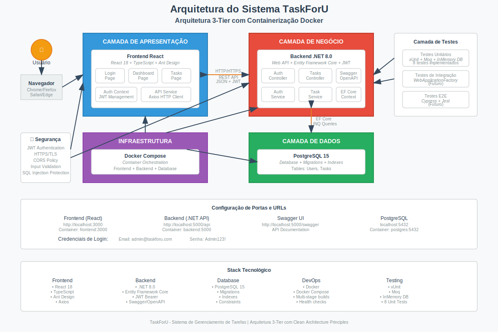
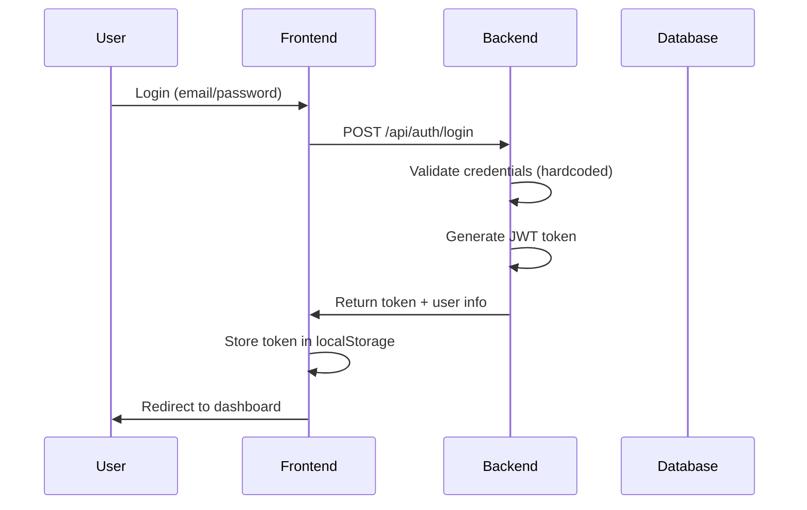
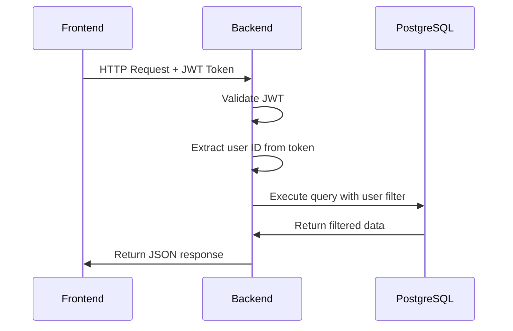

# Arquitetura do Sistema TaskForU

## 📋 Visão Geral

O TaskForU é uma aplicação de gerenciamento de tarefas construída seguindo uma arquitetura de três camadas (3-tier architecture) com separação clara de responsabilidades. O sistema utiliza uma abordagem moderna com containerização Docker e comunicação via API RESTful.

## 🏗️ Arquitetura Geral

### Diagrama de Arquitetura


### Componentes Principais

1. **Frontend (Presentation Layer)**
   - React.js 18 com TypeScript
   - Redux Toolkit para gerenciamento de estado global
   - React Query (TanStack Query) para cache e sincronização de dados
   - Ant Design para componentes UI
   - Comunicação HTTP via Axios

2. **Backend (Business Logic Layer)**
   - .NET 8.0 Web API
   - Entity Framework Core como ORM
   - Autenticação JWT Bearer
   - Swagger/OpenAPI para documentação

3. **Database (Data Layer)**
   - PostgreSQL 15
   - Migrations automáticas via EF Core
   - Containerizado com Docker

4. **Infrastructure**
   - Docker Compose para orquestração
   - Nginx (futuro) para proxy reverso
   - Volumes persistentes para dados

## 🎯 Padrões Arquiteturais

### 1. Clean Architecture
O backend segue os princípios da Clean Architecture:

```
├── Controllers/     # Interface Adapters
├── Services/        # Use Cases / Business Logic
├── Models/          # Entities
├── DTOs/           # Data Transfer Objects
├── Data/           # Infrastructure / Data Access
└── Tests/          # Test Layer
```

### 2. Repository Pattern
Implementado através do Entity Framework Core:
- `ApplicationDbContext` como Unit of Work
- Repositories implícitos via `DbSet<T>`
- Separação entre modelos de domínio e DTOs

### 3. Dependency Injection
Configurado no `Program.cs`:
```csharp
builder.Services.AddScoped<ITaskService, TaskService>();
builder.Services.AddScoped<IAuthService, AuthService>();
```

### 4. Redux Pattern (Frontend)
Implementado com Redux Toolkit para gerenciamento de estado:
- **Store**: Estado global centralizado
- **Slices**: Redutores e actions organizados por domínio
- **Selectors**: Funções para acessar estado específico
- **Middleware**: Redux DevTools para debugging

### 5. Server State Management (Frontend)
Implementado com React Query (TanStack Query):
- **Queries**: Cache automático de dados do servidor
- **Mutations**: Operações de escrita com invalidação de cache
- **Optimistic Updates**: Atualizações otimistas para melhor UX
- **Background Refetch**: Sincronização automática de dados

## 🔄 Fluxo de Dados

### Autenticação


### Operações CRUD


## 🛡️ Segurança

### Autenticação e Autorização
- **JWT Bearer Tokens**: Stateless authentication
- **Token Expiration**: Configurável via appsettings
- **User Isolation**: Todas as queries filtradas por userId
- **HTTPS**: Configurado para produção

### Validação de Dados
- **Frontend**: Validação de formulários com Ant Design
- **Backend**: Data Annotations nos DTOs
- **Database**: Constraints e foreign keys

### Proteção contra Ataques
- **SQL Injection**: Prevenido pelo Entity Framework
- **XSS**: Sanitização automática do React
- **CSRF**: Tokens JWT stateless
- **CORS**: Configurado para domínios específicos

## 📊 Camadas da Aplicação

### Frontend Layer
```
src/
├── components/          # Componentes reutilizáveis
│   ├── AppLayout.tsx   # Layout principal
│   └── ProtectedRoute.tsx # Proteção de rotas
├── pages/              # Páginas da aplicação
│   ├── Login.tsx       # Tela de login
│   ├── Dashboard.tsx   # Dashboard principal
│   ├── Tasks.tsx       # Gerenciamento de tarefas (Context API)
│   └── TasksNew.tsx    # Gerenciamento de tarefas (Redux + React Query)
├── store/              # Redux Toolkit
│   ├── index.ts        # Configuração da store
│   ├── hooks.ts        # Hooks tipados do Redux
│   └── slices/         # Slices por domínio
│       └── uiSlice.ts  # Estado da interface
├── hooks/              # React Query hooks
│   └── useTasks.ts     # Hooks para operações de tarefas
├── lib/                # Configurações
│   └── queryClient.ts  # Configuração do React Query
├── services/           # Camada de serviços
│   └── api.ts          # Cliente HTTP
├── contexts/           # Contextos React (legado)
│   ├── AuthContext.tsx # Contexto de autenticação
│   └── TaskContext.tsx # Contexto de tarefas (legado)
└── types/              # Definições TypeScript
    └── index.ts        # Tipos compartilhados
```

### Backend Layer
```
backend/
├── Controllers/        # Endpoints da API
│   ├── AuthController.cs
│   └── TasksController.cs
├── Services/           # Lógica de negócio
│   ├── IAuthService.cs
│   ├── AuthService.cs
│   ├── ITaskService.cs
│   └── TaskService.cs
├── Models/             # Entidades do domínio
│   ├── User.cs
│   └── Task.cs
├── DTOs/               # Objetos de transferência
│   ├── UserDto.cs
│   ├── TaskDto.cs
│   └── PagedTasksDto.cs  # DTO para paginação
├── Data/               # Acesso a dados
│   └── ApplicationDbContext.cs
└── Tests/              # Testes unitários
    └── TaskServiceTests.cs
```

## 🔧 Configurações e Ambiente

### Variáveis de Ambiente

#### Backend (.NET)
```bash
ASPNETCORE_ENVIRONMENT=Development
ASPNETCORE_URLS=http://+:5000
JWT_SECRET=your-super-secret-key-here
JWT_ISSUER=TaskForU.Api
JWT_AUDIENCE=TaskForU.Frontend
ConnectionStrings__DefaultConnection=Host=postgres;Database=taskforu;Username=postgres;Password=postgres123
```

#### Frontend (React)
```bash
REACT_APP_API_URL=http://localhost:5000/api
```

#### Database (PostgreSQL)
```bash
POSTGRES_DB=taskforu
POSTGRES_USER=postgres
POSTGRES_PASSWORD=postgres123
```

### Docker Compose Services
```yaml
services:
  postgres:    # Database layer
  backend:     # API layer
  frontend:    # Presentation layer
```

## 📈 Escalabilidade e Performance

### Estratégias Implementadas
1. **Paginação Completa**: Sistema robusto com total de registros
   - Backend retorna `PagedTasksDto` com metadados completos
   - Frontend usa `totalCount` real para navegação precisa
   - Mantém filtros aplicados durante navegação
   - Suporte a diferentes tamanhos de página
2. **Filtros Avançados**: Busca por status e texto
   - Combinação de múltiplos filtros
   - Aplicação no backend para performance
   - Preservação de estado durante paginação
3. **Índices**: Configurados no Entity Framework
4. **Caching**: Headers HTTP apropriados
5. **Lazy Loading**: Componentes React otimizados

### Melhorias Futuras
1. **Redis Cache**: Para sessões e dados frequentes
2. **CDN**: Para assets estáticos
3. **Load Balancer**: Para múltiplas instâncias
4. **Database Sharding**: Para grandes volumes
5. **Microservices**: Separação por domínio

## 🧪 Estratégia de Testes

### Testes Unitários (Backend)
- **Framework**: xUnit
- **Mocking**: Moq
- **Database**: Entity Framework InMemory
- **Cobertura**: Services e Controllers

### Testes de Integração (Futuro)
- **WebApplicationFactory**: Para testes end-to-end
- **TestContainers**: PostgreSQL real para testes
- **Postman/Newman**: Testes de API automatizados

### Testes Frontend (Futuro)
- **Jest**: Testes unitários
- **React Testing Library**: Testes de componentes
- **Cypress**: Testes end-to-end

## 🚀 Deploy e DevOps

### Containerização
- **Multi-stage builds**: Otimização de imagens
- **Health checks**: Monitoramento de serviços
- **Volumes**: Persistência de dados
- **Networks**: Isolamento de comunicação

### CI/CD (Futuro)
```yaml
Pipeline:
  1. Code Push → GitHub
  2. Automated Tests → GitHub Actions
  3. Build Images → Docker Registry
  4. Deploy → Kubernetes/Docker Swarm
  5. Health Check → Monitoring
```

## 📊 Monitoramento e Observabilidade

### Logs
- **Structured Logging**: Serilog (futuro)
- **Log Levels**: Debug, Info, Warning, Error
- **Correlation IDs**: Rastreamento de requests

### Métricas (Futuro)
- **Application Metrics**: Prometheus
- **Infrastructure Metrics**: Grafana
- **Health Checks**: Custom endpoints
- **Performance**: Application Insights

## 🔄 Versionamento da API

### Estratégia
- **URL Versioning**: `/api/v1/tasks`
- **Backward Compatibility**: Manter versões anteriores
- **Deprecation Policy**: 6 meses de suporte

### Documentação
- **OpenAPI 3.0**: Especificação completa
- **Swagger UI**: Interface interativa
- **Postman Collection**: Testes manuais

## 🎨 Design Patterns Utilizados

### Backend
1. **Repository Pattern**: Via Entity Framework
2. **Dependency Injection**: .NET Core DI Container
3. **Factory Pattern**: JWT Token generation
4. **Strategy Pattern**: Authentication strategies
5. **Builder Pattern**: Entity Framework configuration

### Frontend
1. **Provider Pattern**: React Context API
2. **Hook Pattern**: Custom hooks para lógica
3. **Component Composition**: Ant Design components
4. **Observer Pattern**: State management
5. **Facade Pattern**: API service layer

## 📚 Documentação Técnica

### APIs
- **Swagger/OpenAPI**: http://localhost:5000/swagger
- **Postman Collection**: Disponível no repositório
- **API Documentation**: Inline comments

### Código
- **README.md**: Instruções de setup
- **ARCHITECTURE.md**: Este documento
- **Inline Comments**: Código autodocumentado
- **Type Definitions**: TypeScript interfaces

## 🔮 Roadmap Técnico

### Fase 1 (Atual) ✅
- [x] Arquitetura básica 3-tier
- [x] Autenticação JWT
- [x] CRUD completo
- [x] Containerização Docker
- [x] Testes unitários básicos
- [x] Paginação robusta com total de registros
- [x] Filtros avançados combinados
- [x] Interface responsiva completa

### Fase 2 (Próximos 3 meses)
- [ ] Implementar Redis cache
- [ ] Adicionar testes de integração
- [ ] Configurar CI/CD pipeline
- [ ] Implementar logging estruturado
- [ ] Adicionar health checks

### Fase 3 (6 meses)
- [ ] Migrar para microservices
- [ ] Implementar Event Sourcing
- [ ] Adicionar real-time notifications
- [ ] Configurar monitoring completo
- [ ] Implementar auto-scaling

## 🤝 Contribuição

### Padrões de Código
- **C#**: Microsoft coding standards
- **TypeScript**: ESLint + Prettier
- **Git**: Conventional commits
- **Documentation**: Markdown + Mermaid

### Code Review
- **Pull Requests**: Obrigatórios
- **Automated Tests**: Devem passar
- **Code Coverage**: Mínimo 80%
- **Security Scan**: Automated tools

---

*Este documento é versionado e deve ser atualizado conforme a evolução da arquitetura do sistema.*